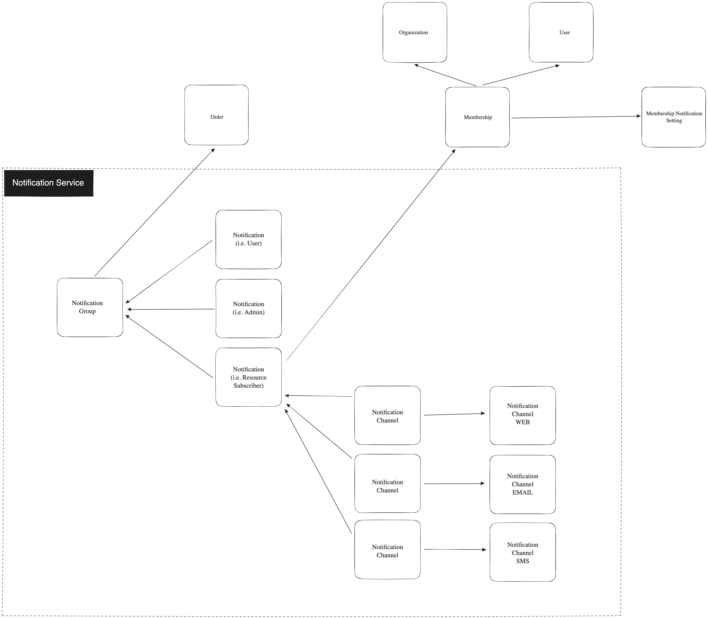

# 001 Notifications
Notifications are a mechanism used by our app to comunicate with a user when a specific action on the platform has occored. For example, if a user submits a "Design Request", we want to notify any available artists that a new Design Request is ready to be claimed.

## Requirements
- [ ] System is able to schedule a notification with a single function
- [ ] Notifications can have multiple delivery mechanisms (in-app, email, SMS)
- [ ] Users can configure there own delivery mechanism (Slack)
- [ ] We should know when a notification was sent, to whom, and exactly what was sent in the contents of the notification
- [ ] Users should be able to configure their notification preference (email, sms, both)
- [ ] A notification is sent to a user (or organization? spike)
- [ ] Notifications for a particular user can be audited
- [ ] Notifications for a particular resource can be audited

## Notification Lifecycle
1. User subscribes to notification topics.
    - Users can select which types of notifications they want to receive. These can be based on "topics" like order created, order shipped, etc. The user's selected topics are saved in their profile settings.
2. Action occurs (i.e., order.created event emitted).
    - Whenever an action associated with a topic occurs, a system event is triggered.
3. Look up notifications to be sent based on user-subscribed topics.
    - The system checks the type of event triggered against the user's subscribed topics. If there is a match, the notification process continues.
        - order.created.customer (thanks for your order)
        - order.created.artist (someone placed an order with your design)
        - order.created.fulfillment (order placed)
4. Retrieve each subscriber's notification preferences.
    - The system retrieves user notification preferences to identify the preferred delivery mechanism(s) for the notification (in-app, email, SMS, or a combination of these).
5. Schedule the notifications.
    - Based on the user preferences and their topic subscriptions, notifications are scheduled. Each notification includes the necessary data like recipient, content, and delivery mechanism.
6. Send the notifications.
    - The system initiates the process of sending the scheduled notifications to the corresponding users.
7. Record the notifications.
    - Every notification sent is recorded along with the date/time of sending, recipient, content, and topic. This is useful for tracking and future reference.
8. Users receive and interact with the notifications.
    - Users receive the notifications through their preferred delivery mechanism(s) and can then interact with the notification, for example, by clicking on a link to view the order.
9. Track user interaction.
    - The system tracks when the user interacts with the notification and records this interaction. This helps in understanding user engagement with the platform.
10. If the notification fails, handle the error.
    - The system has mechanisms in place to handle errors if a notification fails to send, such as retrying or logging for further investigation. It should also update the user's profile with the failed notification to notify them about the missed notification if necessary.



## Example Code
```ts
// order-service/update-order.ts

const createOrder = () => {
    // ...
    events.emit('order.created', {
        prevOrder: null,
        nextOrder: {
            // ...
        },
    })
}

```

```ts
// order-service/events/order-created.ts
const handleOrderCreated = (prevOrder, nextOrder) => {
    if(prevOrder.status !== nextOrder.status) {
        if(nextOrder.status === 'CREATED') {
            transitionOrderToCreated()
        }
    }
}
```

```ts
// order-service/transitions/order-created
const transitionOrderToCreated = (prevOrder, nextOrder) => {
    const notificationChannelTemplates = notificationService.listNotificationChannelTemplates({
                    resourceType: NotificationResourceType.ORDER,
                    resourceAction: NotificationResourceAction.CREATED,
                })

    const notificatinnels = notificationChannelTemplates.map(tempalate => {
        template.render(onCha{
            order: nextOrder
        })
    })

    const notification = await notificationService.createNotification({
        notification: {
            resourceType: NotificationResourceType.ORDER,
            resourceAction: NotificationResourceAction.CREATED,
            sendAt: new Date(),
            recipientUserIds: [''],
            status: NotificationStatus.SCHEDULED, // NotificationStatus.PROCESSING, NotificationStatus.SENT, NotificationStatus.ERROR
            channels: notificationChannels
        }
    })

}
```

```ts
// notification-service/consumers/notification-created.ts
const handleNotificationCreated = (notification) => {
    for(const channel of notification.channels) {
        switch(channel.type) {
            case NotificationChannelType.EMAIL:
                notificationService.notificationChannelEmailSend(channel)
            case NotificationChannelType.SMS:
                notificationService.notificationChannelSmsSend(channel)
            case NotificationChannelType.WEB;
                notificationService.notificationChannelWebSend(channel)
        }
    }
}
```

```ts
// notification/service/methods/index.ts

const service = {
    notificationChannelSmsSend: (channel) => {},
    notificationChannelEmailSend: (channel) => {},
    notificationChannelWebSend: (channel) => {}
}
```